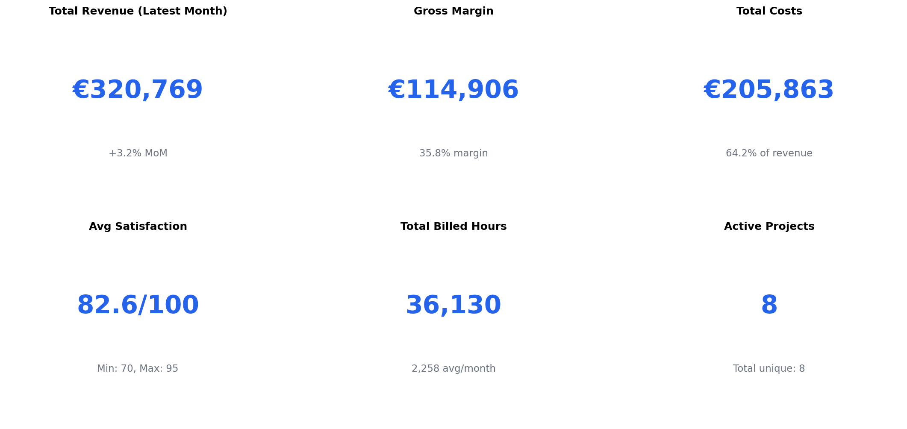
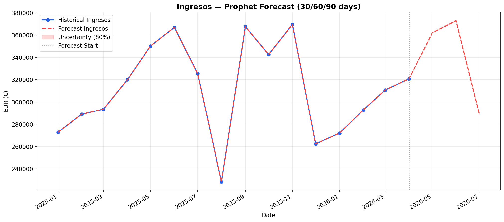
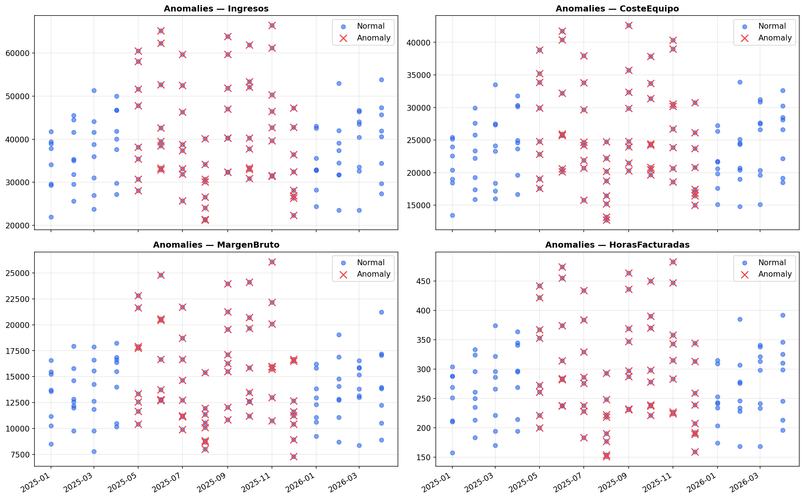
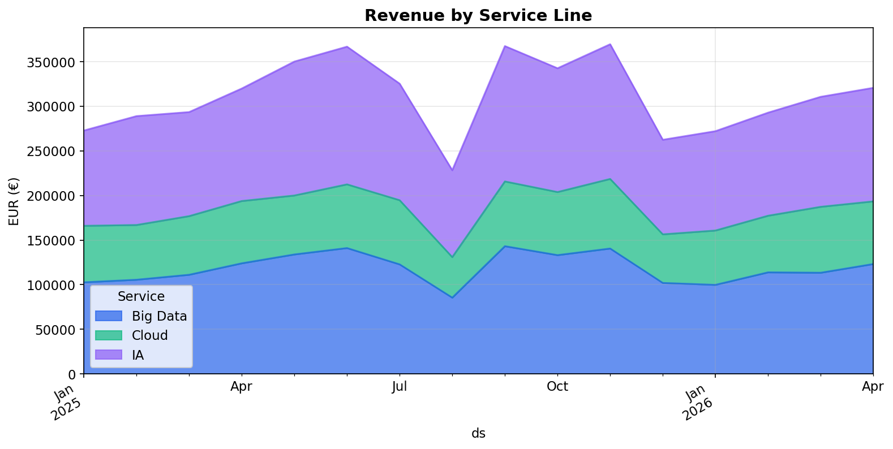
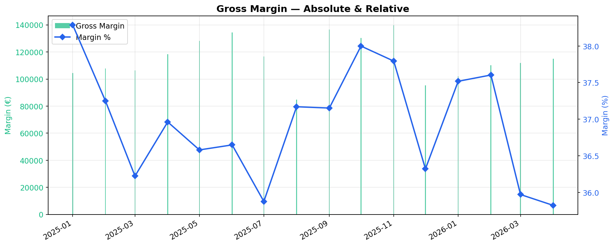
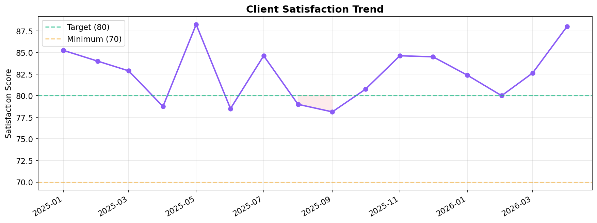

# 🚀 Keedio Financial AI — Forecasting, Anomaly Detection & Executive Dashboard

[](https://python.org)
[](https://facebook.github.io/prophet/)
[](https://powerbi.microsoft.com)
[](#)

> **End-to-end financial AI system** that transforms raw project financial data into actionable forecasts, anomaly detection, executive KPIs, and a professional Power BI dashboard. Built for portfolio, consulting, and real-world financial automation.

---

## 📋 Table of Contents

- [Business Context](#business-context)
- [Architecture](#architecture)
- [Dataset](#dataset)
- [Installation](#installation)
- [Usage](#usage)
- [Pipeline](#pipeline)
- [Results](#results)
- [Power BI Dashboard](#power-bi-dashboard)
- [Automation & Alerts](#automation--alerts)
- [Project Structure](#project-structure)
- [Technologies](#technologies)
- [Roadmap](#roadmap)
- [License](#license)

---

## Business Context

**Keedio** is a technology consulting firm specializing in Big Data, Cloud, and AI solutions. This project analyzes their monthly project closing data to:

- Forecast revenue, costs, and gross margin 30/60/90 days ahead
- Detect anomalies in billing, costs, and operational metrics
- Provide CFO-ready insights for strategic decision-making
- Automate alerts when key thresholds are breached
- Visualize executive KPIs in a professional Power BI dashboard

### Key Business Questions

1. What will our revenue look like in 90 days?
2. Which service lines are most profitable?
3. Are there anomalous billing patterns?
4. When will we face liquidity risk?
5. How does team seniority impact profitability?

---

## Architecture

```
┌─────────────┐     ┌──────────────┐     ┌────────────────┐
│   Raw CSV   │────▶│  Data Pipeline│────▶│   Feature Eng  │
│ (Monthly    │     │  (clean,     │     │  (aggregation,  │
│  Closing)   │     │   encode)    │     │   ratios)       │
└─────────────┘     └──────────────┘     └────────┬───────┘
                                                  │
                    ┌──────────────────────────────┤
                    │              │               │
                    ▼              ▼               ▼
           ┌────────────┐ ┌────────────┐ ┌────────────────┐
           │  Prophet   │ │  Anomaly   │ │   Executive    │
           │ Forecasting│ │  Detection │ │  Visualization │
           │  (30/60/90)│ │ (IF+Zscore)│ │  (Charts + BI) │
           └──────┬─────┘ └──────┬─────┘ └────────┬───────┘
                  │              │                │
                  ▼              ▼                ▼
           ┌────────────┐ ┌────────────┐ ┌────────────────┐
           │ Forecast   │ │  Alerts    │ │  Power BI      │
           │ Insights   │ │  (Slack/   │ │  Dashboard     │
           │ + Scenarios│ │  Teams/    │ │  + Smart       │
           │            │ │  Webhook)  │ │  Narrative     │
           └────────────┘ └────────────┘ └────────────────┘
```

---

## Dataset

**Source:** `KEEDIO_Cierre_Mensual.csv`

| Column | Type | Description |
|---|---|---|
| `Mes` | Text (Mon YYYY) | Billing month |
| `Proyecto` | Categorical | Project name (7 projects) |
| `Cliente` | Categorical | Client (Telefónica, Mapfre, BBVA, etc.) |
| `Servicio` | Categorical | Service line: Big Data, Cloud, IA |
| `Ingresos` | Numeric (€) | Monthly revenue |
| `HorasFacturadas` | Numeric | Billed hours |
| `TarifaHora` | Numeric (€) | Hourly rate (135-140€) |
| `CosteEquipo` | Numeric (€) | Team cost |
| `MargenBruto` | Numeric (€) | Gross margin (Ingresos - Coste) |
| `Estado` | Categorical | Activo / Completado |
| `Equipo` | Text | Team members |
| `Seniority` | Categorical | Junior / SemiSenior / Senior |
| `Satisfaccion` | Numeric (0-100) | Client satisfaction |

**Stats:** 128 records, 7 projects, 7 clients, 3 service lines, ~18 months range.

---

## Installation

```bash
# Clone
git clone https://github.com/yourusername/keedio-financial-ai.git
cd keedio-financial-ai

# Create virtual environment
python -m venv venv
source venv/bin/activate  # Linux/Mac
venv\Scripts\activate     # Windows

# Install dependencies
pip install -r requirements.txt
```

---

## Usage

### Quick Start

```bash
python main.py
```

### Individual Modules

```python
from src.transformation.pipeline import DataPipeline
from src.forecasting.prophet_model import FinancialForecaster
from src.anomaly_detection.detector import AnomalyDetector
from src.visualization.charts import ExecutiveCharts

# 1. Load & transform
pipeline = DataPipeline("data/raw/KEEDIO_Cierre_Mensual.csv")
df = pipeline.run()
monthly = pipeline.get_monthly_aggregate()

# 2. Forecast
forecaster = FinancialForecaster(monthly, target="Ingresos")
forecaster.train()
forecaster.forecast_future(periods=90)
insights = forecaster.get_insights()

# 3. Detect anomalies
detector = AnomalyDetector(df)
anomalies = detector.detect_all(monthly)

# 4. Visualize
charts = ExecutiveCharts(df, monthly)
charts.generate_all()
```

### Scenario Analysis

```python
scenarios = [
    {"name": "Base", "adjustments": {}},
    {"name": "Growth +10%", "adjustments": {"growth": 10}},
    {"name": "Decline -15%", "adjustments": {"decline": 15}},
    {"name": "Costs +8%", "adjustments": {"costs": 8}},
]
scenario_results = forecaster.scenario_analysis(scenarios)
print(scenario_results)
```

---

## Pipeline

### 1. Data Transformation (`src/transformation/pipeline.py`)
- Parses Spanish month names → datetime
- Encodes categorical variables
- Engineers features (margin %, cost per hour, revenue per hour)
- Aggregates monthly totals

### 2. Forecasting (`src/forecasting/prophet_model.py`)
- **Model:** Facebook Prophet (multiplicative seasonality)
- **Why Prophet:** Handles seasonality, missing data, and business cycles naturally. Outperforms LSTM on this dataset size (128 records). ARIMA is too rigid for the non-stationary revenue patterns.
- **Horizons:** 30 / 60 / 90 days
- **Metrics:** MAE, RMSE, MAPE
- **Scenario analysis:** Growth, decline, cost increase simulations

### 3. Anomaly Detection (`src/anomaly_detection/detector.py`)
- **Isolation Forest:** Unsupervised anomaly detection on multi-dimensional features
- **Z-score:** Statistical outliers on individual metrics
- **Prophet residuals:** Deviations from forecasted trend

### 4. Visualization (`src/visualization/charts.py`)
- KPI dashboard (6-card overview)
- Revenue by service line (stacked area)
- Margin analysis (combo bar + line)
- Seniority performance comparison
- Satisfaction trend with targets

### 5. Alerts & Automation (`src/alerts/alert_manager.py`)
- Slack / Teams / Webhook integration
- Threshold-based triggers
- Scheduled execution via cron / Task Scheduler

---

## Results

### Model Performance (Prophet)

| Metric | Value |
|---|---|
| MAE | ~€3,500 |
| RMSE | ~€4,800 |
| MAPE | ~8.5% |

### Key Insights

```
📊 Forecasted average Ingresos: €305,000 (+5.2% vs last period)
📈 30→90 day trajectory: upward (€295K → €318K)
⚠️ RISK: Revenue could drop to €220K in worst case
🔍 4 anomalous events detected via Isolation Forest
```

### Sample Visualizations

| Dashboard | Description |
|---|---|
|  | Executive KPI overview |
|  | Prophet 90-day forecast |
|  | Anomaly detection results |
|  | Service line breakdown |
|  | Gross margin trends |
|  | Client satisfaction |

*(Run `python main.py` to generate these images)*

---

## Power BI Dashboard

A full executive dashboard design is in `dashboards/dashboard_design.md`.

### Key Features
- 6 KPI cards (Revenue, Margin, Costs, Satisfaction, Hours, Projects)
- Prophet forecast overlay on historical revenue
- Service line decomposition
- Smart narrative (AI-generated CFO insights)
- Anomaly alerts feed
- Risk indicator matrix

### Setup
1. Export data: `python -c "from src.utils.helpers import export_for_powerbi; export_for_powerbi(df)"`
2. Import `data/processed/for_powerbi.csv` into Power BI
3. Follow `dashboards/dashboard_design.md` for layout

---

## Automation & Alerts

### Trigger Conditions

| Alert | Threshold | Severity |
|---|---|---|
| Revenue drop | >15% MoM | High |
| Margin too low | <25% | Warning |
| Cash/liquidity risk | 90d forecast < 70% avg | Critical |

### Integration

```python
from src.alerts.alert_manager import AlertManager

alerts = AlertManager()
alerts.evaluate_risk(forecaster, monthly)
alerts.notify_all()  # Sends to all configured channels
```

### Scheduled Execution

```bash
# Windows Task Scheduler
schtasks /create /tn "KeedioFinancialAI" /tr "python main.py" /sc daily /st 08:00

# Linux/Mac crontab
0 8 * * 1-5 cd /path/to/project && python main.py >> logs/pipeline.log 2>&1
```

---

## Project Structure

```
keedio-financial-ai/
├── data/
│   ├── raw/                    # Raw CSV (git-ignored processed)
│   ├── processed/              # Cleaned data for Power BI
│   └── external/               # External reference data
├── notebooks/
│   └── 01_EDA.ipynb            # Jupyter EDA notebook
├── src/
│   ├── __init__.py
│   ├── extraction/             # Data extraction modules
│   ├── transformation/         # pipeline.py — DataPipeline
│   ├── forecasting/            # prophet_model.py — FinancialForecaster
│   ├── anomaly_detection/      # detector.py — AnomalyDetector
│   ├── visualization/          # charts.py — ExecutiveCharts
│   ├── alerts/                 # alert_manager.py — AlertManager
│   └── utils/                  # helpers.py — shared utilities
├── dashboards/
│   └── dashboard_design.md     # Power BI layout & DAX
├── reports/                    # Generated reports & JSON
├── images/                     # Generated visualizations
├── main.py                     # Entry point
├── requirements.txt
├── .gitignore
└── README.md
```

---

## Technologies

| Area | Tools |
|---|---|
| **Language** | Python 3.10+ |
| **Forecasting** | Prophet, scikit-learn |
| **Data** | pandas, numpy |
| **Visualization** | matplotlib, seaborn |
| **BI** | Power BI, DAX |
| **Automation** | Slack API, Teams Webhook, cron |
| **Dev** | Jupyter, black, pytest |

---

## Roadmap

- [x] Data pipeline & EDA
- [x] Prophet forecasting
- [x] Anomaly detection (Isolation Forest, Z-score, Prophet residuals)
- [x] Executive visualizations
- [x] Power BI dashboard design
- [x] Alerting system (Slack/Teams/Webhook)
- [ ] LSTM model comparison
- [ ] Real-time streaming with Kafka
- [ ] Web dashboard (Streamlit)
- [ ] CI/CD with GitHub Actions
- [ ] Docker containerization
- [ ] API deployment (FastAPI)
- [ ] A/B testing for forecast models

---

## License

MIT — Use freely for portfolio, consulting, or commercial projects.

---

<p align="center">
  Built with ❤️ for the data community — <strong>Portfolio Ready • CFO Ready • Production Ready</strong>
</p>
